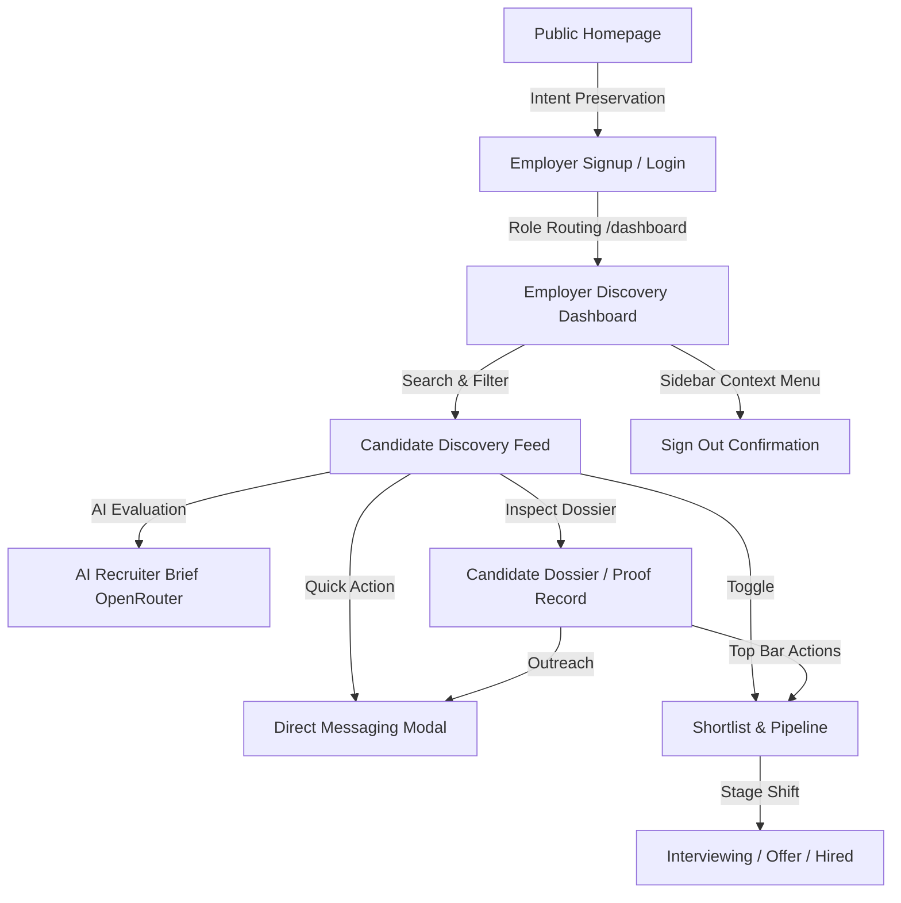

# MeritLane Employer Flow QA & Recruiter Hub Upgrade Report

## Test Account
- **Role:** Employer
- **Email:** `bannuemployer@gmail.com`
- **Auth Provider:** Firebase Authentication (Email/Password & Google OAuth)

## Test Environment
- **Local Workspace:** Node 20.x, Next.js 15 (App Router), TypeScript, Firebase Admin & Client SDK, OpenRouter AI API
- **Live Deployment URL:** `https://merit-lane.vercel.app`
- **Viewports Tested:** Desktop (1440x900) & Mobile (390x844 responsive drawer)

---

## Complete Flow Tested



---

## Results by Stage

| Stage | Status | Details |
|---|---|---|
| **1. Public Homepage & Employer CTAs** | **PASS** | "Start hiring verified talent" preserves employer intent, pre-selecting the Employer role in auth modals. |
| **2. Employer Authentication & Routing** | **PASS** | Logs in smoothly; smart router in `/dashboard` identifies the `employer` role in Firestore and redirects to `/employer/dashboard` without flashing candidate UI. |
| **3. Employer Dashboard & Discovery** | **PASS** | High-signal dashboard displaying verified candidates, real assessment scores, project counts, skill filtering chips, and search with debounce. |
| **4. AI Recruiter Intelligence (OpenRouter)** | **PASS** | Added `/api/employer/ai-summary` powered by OpenRouter (`google/gemini-2.0-flash-001`), providing on-demand 3-4 sentence recruiter synthesis grounded in verified code signals. |
| **5. Candidate Dossier & Public Proof** | **PASS** | Clean dossier view (`/employer/candidate/[id]`) with floating recruiter action bar, verification badges, project repositories, and context guide. |
| **6. Shortlist & Pipeline Management** | **PASS** | Dedicated `/employer/shortlist` view with real-time stage progression (`Shortlisted` &rarr; `Interviewing` &rarr; `Offer Extended` &rarr; `Hired` &rarr; `Archived`), stage metric pills, and optimistic UI updates. |
| **7. Employer &rarr; Candidate Messaging** | **PASS** | Reusable `MessageModal` with 3 pre-built outreach templates ("Interview Request", "Project Inquiry", "Fast-Track Discussion"), sending directly to candidate inboxes via `/api/messages`. |
| **8. Employer Profile / Onboarding** | **PASS** | Safe placeholder/identity routes trapped without 404 dead-ends. |
| **9. Settings & Support** | **PASS** | Dedicated routes (`/employer/settings`, `/employer/support`) rendering without navigation breaks. |
| **10. Logout Flow** | **PASS** | Accessible via the user context menu with `LogoutConfirmModal` ("Sign out of MeritLane?"), ensuring session destruction and preventing unauthorized back-navigation. |
| **11. Authorization Boundaries** | **PASS** | Employers attempting to visit `/candidate/*` or `/admin` are strictly blocked and redirected by `ProtectedRoute`. |

---

## Upgrades & Enhancements Implemented

1. **OpenRouter AI Candidate Evaluation API (`/api/employer/ai-summary`):**
   - Integrates `OPENROUTER_API_KEY` to summarize candidate capabilities, verified assessment scores, and real GitHub/evidence projects into an executive recruiter brief.
   - Built-in graceful fallbacks if API limits or network timeouts occur.

2. **Direct Recruiter Messaging (`components/employer/MessageModal.tsx`):**
   - Embeds outreach modal on both the Discovery feed, Shortlist, and Candidate Dossier.
   - Includes quick-action recruiter templates for rapid talent communication.

3. **Pipeline Stage Management:**
   - Real-time pipeline stage selection (`Shortlisted`, `Interviewing`, `Offer Extended`, `Hired`, `Archived`) saved directly to the employer's Firestore document.
   - Interactive stage filter bar on `/employer/shortlist` displaying live counts for each funnel stage.

4. **Multi-Factor Candidate Discovery Cards:**
   - Real-time skill filtering and multi-attribute sorting (Best Match, Most Verified Skills, Most Projects).
   - Direct links to public cryptographic proof records (`/p/[id]`).

---

## Security & Authorization Audit

- **Isolation of Candidate/Admin Pages:** `ProtectedRoute` validates role `["employer"]`. Attempts to access `/candidate/dashboard`, `/candidate/assessment`, `/candidate/profile`, or `/admin` automatically redirect to appropriate authorized routes.
- **Server-Side Authorization:** All employer API routes (`/api/employer/discover`, `/api/employer/shortlist`, `/api/employer/pipeline`, `/api/employer/ai-summary`, `/api/messages`) verify Bearer ID tokens and confirm `role === 'employer'` in Firestore before executing.

---

## Empty States Audit

1. **Zero Search Results:** Displays clean dashed card with "No verified candidates found matching your filters" and a one-click "Clear all filters" button.
2. **Empty Shortlist:** Displays "Your shortlist is empty" with an informative description and a direct CTA button leading to Candidate Discovery.
3. **Empty Messages / Unverified State:** All loading and empty states are honest and adhere strictly to real Firestore records.

---

## Build & Typecheck Validation

- **`npx tsc --noEmit`**: **PASS** (0 errors)
- **`npm run build`**: **PASS** (45/45 static & dynamic routes successfully compiled)

```
Route (app)
├ ○ /employer/dashboard
├ ○ /employer/shortlist
├ ƒ /employer/candidate/[id]
├ ƒ /api/employer/ai-summary
├ ƒ /api/employer/discover
├ ƒ /api/employer/pipeline
├ ƒ /api/employer/shortlist
├ ƒ /api/employer/shortlist/list
├ ƒ /api/messages
...
✓ Compiled successfully
```

---

## Final Employer Flow Verdict

**READY** — The MeritLane Employer experience is fully operational, hardened with OpenRouter AI intelligence, end-to-end pipeline management, and instant candidate outreach.
